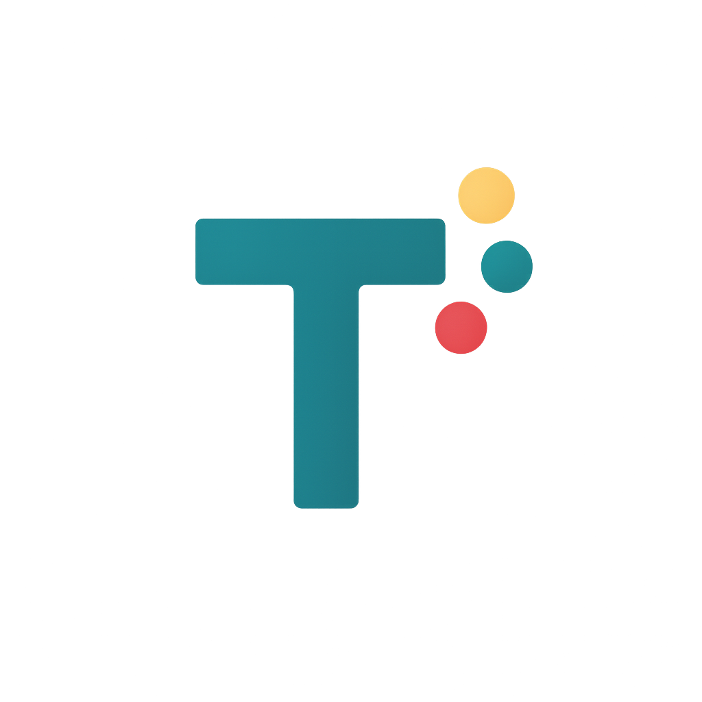

<div align="center">
  <a href="https://useterse.ai">
    <picture>
      <source media="(prefers-color-scheme: dark)" srcset="frontend/public/terse.png">
      
    </picture>
  </a>

  <h1>Terse</h1>

  <p><strong>Workflow building for the coding agent era.</strong></p>

  <p>
    The AI workflow platform for coding agents.<br/>
    Connect your tools, generate a typed SDK from your workspace, and deploy serverless workflows that mix deterministic tool calls with agentic loops.
  </p>

  <p>
    <a href="https://github.com/TerseAI/Terse/stargazers"></a>
    <a href="https://www.npmjs.com/package/terse-cli"></a>
    <a href="https://www.npmjs.com/package/terse-sdk"></a>
    <a href="https://github.com/TerseAI/Terse/blob/main/LICENSE.md"></a>
    
  </p>

  <p>
    <a href="https://docs.useterse.ai/quickstart"></a>
    <a href="https://docs.useterse.ai"></a>
    <a href="https://useterse.ai"></a>
    <a href="https://www.linkedin.com/company/terse-inc"></a>
  </p>

  <p>
    <a href="https://skills.sh/terseai/terse"></a>
    <a href="https://github.com/TerseAI/Terse/tree/main/packages/terse-claude-plugin"></a>
  </p>

  <p>
    <a href="https://docs.useterse.ai/quickstart">Quickstart</a> ·
    <a href="https://docs.useterse.ai/reference/typescript-sdk">SDK</a> ·
    <a href="https://docs.useterse.ai/reference/cli">CLI</a> ·
    <a href="https://useterse.ai">Sign up</a>
  </p>
</div>

---

## Why Terse

AI agents are fast to build but make mistakes. Deterministic workflows are reliable but slow to set up. Terse lets you mix both in the same workflow: call tools directly when you need precision, hand off to an agent when you need judgment.

- **Code-first.** Workflows are TypeScript in your repo. Review them in PRs, track them in git history.
- **Typed SDK from your workspace.** `terse generate` generates strongly-typed handles for the channels, repos, projects, and tools you actually use, so the LLM (and your IDE) only sees what's in scope.
- **Mix tools and agents.** Call a tool deterministically when you know what you want. Hand off to an agent when you need judgment. Same workflow, same types.
- **Scoped skills, no surprises.** Tool access is bounded by the skills you declare. The agent can't reach outside that scope. No more catastrophic deletions caused by hallucinations.
- **Secrets and OAuth, handled.** Integration credentials live in Terse's secret manager (using Google Secret Manager) with automatic OAuth refresh.
- **Serverless deploys.** `terse deploy` ships your workflows to the Terse Cloud data plane (isolated Modal sandboxes). Every run is logged with a complete action trail.
- **Run it where you want.** Terse splits into a **control plane** (orchestrator, triggers, dashboard, history) and a **data plane** (your job code). Each runs on Terse Cloud or in your network, independently — see [Deployment](#deployment) below.

## Quickstart

Get a workflow live in under 5 minutes — full guide at [docs.useterse.ai/quickstart](https://docs.useterse.ai/quickstart).

With Code

```bash
npm install -g terse-cli
terse init my-project
cd my-project
code . # build some workflows
terse deploy
```

With our Claude Code skill
```bash
npx skills add TerseAI/Terse

# in claude
/terse:create describe your workflow
```

That's it. `terse deploy` ships to the Terse Cloud data plane — no infra to stand up.

## Deployment

Terse has two planes you can place independently. Most users pick one of the named tiers below.

| Tier            | Control plane          | Data plane             | How to set up                                                              |
| --------------- | ---------------------- | ---------------------- | -------------------------------------------------------------------------- |
| **Managed**     | Terse Cloud            | Terse Cloud (Modal)    | Default after `terse init`                                                 |
| **Hybrid**      | Terse Cloud            | Your infrastructure    | `terse attach` ([guide](https://docs.useterse.ai/self-hosting))            |
| **Self-hosted** | Your infrastructure    | Your infrastructure    | `npx create-terse` ([guide](https://docs.useterse.ai/self-hosting-control-plane)) |

`npx create-terse` clones the repo, mints secrets, brings up Postgres in Docker, runs migrations, starts the app, and writes the env so `terse-cli` already points at your self-hosted control plane.

## What a workflow looks like

A Terse workflow is a single TypeScript file. The job below watches a repo for new pull requests, posts a deterministic Slack message announcing the PR, then threads a Block Kit summary under it:

```ts
import { GithubPRTrigger, generateText, createJob } from "terse-sdk"
import { Repos, Skills, SlackChannel, Triggers, toolbox } from "../terse.generated"
// ^^ Generated based on your workspace

createJob({
    name: "Summarize PR and send slack message",
    triggers: [Triggers.github.onPROpened({ repo: Repos.TerseAI.Terse })],
    onTrigger: async (event: GithubPRTrigger) => {
        // Deterministic call — fixed channel, fixed message. No agent needed.
        const message = await toolbox.slack.sendMessage({
            channelId: SlackChannel.AllTerseInc.channelId,
            message: "New PR from " + event.sender.login + "!"
        })

        // Outputs are strongly typed
        const parentId = message.message_ts

        // Agentic: one prompt in, the model uses the GitHub + Slack tools granted via skills
        await generateText({
            prompt: `
            Summarize this PR ${event.formatForAgentRunner()}.
            Keep it short. Format the summary in Block Kit; include screenshots or diagrams from the PR as image blocks.
            Reply in a thread to the Slack message (thread parent ts: ${parentId}).
            `,
            skills: [
                // Fine tune what the agent has access to. Impossible to touch anything outside this scope
                Skills.github({ repos: [Repos.TerseAI.Terse] }),
                Skills.slack({ channel: SlackChannel.AllTerseInc })
            ]
        })
    }
})
```

The skills passed to `generateText` are the only surface the model can reach: it can post in one Slack channel and read this one repo, nothing else. The deterministic `toolbox.slack.sendMessage` call returns a typed result you can thread on directly, and `generateText` picks up the GitHub and Slack tools without further wiring.

## Integrations

First-class, typed integrations for the tools you already use:

<p>
  
  
  
  
  
  
  
  
  
  
</p>

## What's in this repo

This is the Terse monorepo — the platform code Terse runs in production, plus the public packages used to author workflows.

| Package | Path | Description |
| --- | --- | --- |
| [`terse-cli`](https://www.npmjs.com/package/terse-cli) | `packages/terse-cli` | The `terse` command. Init projects, generate the typed SDK, deploy. |
| [`terse-sdk`](https://www.npmjs.com/package/terse-sdk) | `packages/terse-sdk` | TypeScript runtime SDK for authoring workflows. |
| [`terse-types`](https://www.npmjs.com/package/terse-types) | `terse-types` | Shared types, enums, and helpers. |
| `terse-claude-plugin` | `packages/terse-claude-plugin` | Claude Code integration. |

## Documentation

- **Docs:** [docs.useterse.ai](https://docs.useterse.ai)
- **Quickstart:** [docs.useterse.ai/quickstart](https://docs.useterse.ai/quickstart)
- **SDK reference:** [docs.useterse.ai/reference/typescript-sdk](https://docs.useterse.ai/reference/typescript-sdk)
- **CLI reference:** [docs.useterse.ai/reference/cli](https://docs.useterse.ai/reference/cli)

## Contributing

Issues and PRs welcome. If you're picking up something non-trivial, open an issue first so we can sanity-check the approach. See [CONTRIBUTING.md](CONTRIBUTING.md) for the full guide and [SECURITY.md](SECURITY.md) for the private disclosure process.

Working on the SDK, CLI, or frontend? Clone the repo and:

```bash
pnpm install
pnpm run dev             # watches terse-types, terse-sdk, terse-cli, frontend, backend
pnpm run install-global  # links your local terse-cli as `terse`
```

The frontend and CLI talk to the hosted Terse backend at `api.useterse.ai` by default, so most SDK/CLI/frontend work doesn't need a local backend. Override with `TERSE_BACKEND_URL` if you're pointing at a self-hosted instance.

Backend work needs Postgres, Redis, and the credentials backend integrations expect. See [docs.useterse.ai/self-hosting](https://docs.useterse.ai/self-hosting) for the full list.

### Redis (required for the backend)

The backend uses Redis for job queues (BullMQ), schedules, and rate limiting. It's a hard requirement: `pnpm run dev` exits with `ECONNREFUSED` errors if Redis isn't reachable. Start one locally before running the backend:

```bash
# Docker (recommended)
docker run -d --name terse-redis -p 6379:6379 redis:7

# or Homebrew (macOS)
brew install redis && brew services start redis
```

Set the connection string in `backend/.env` (this is the default, so it's only needed if your Redis runs elsewhere):

```bash
REDIS_URL=redis://localhost:6379
```

BullMQ can silently drop queued jobs under an eviction policy, so the backing Redis must use `maxmemory-policy=noeviction`. That's the default for a fresh Redis, so the commands above need no extra config.

## License

Terse is **source-available** under the [Sustainable Use License v1.0](LICENSE.md). You can read it, fork it, modify it, and self-host it for non-commercial or internal business use. You can't redistribute it commercially or run it as a competing hosted product. The license text in [LICENSE.md](LICENSE.md) is authoritative.

## Links

- **Website:** [useterse.ai](https://useterse.ai)
- **Docs:** [docs.useterse.ai](https://docs.useterse.ai)
- **LinkedIn:** [linkedin.com/company/terse-inc](https://www.linkedin.com/company/terse-inc)
